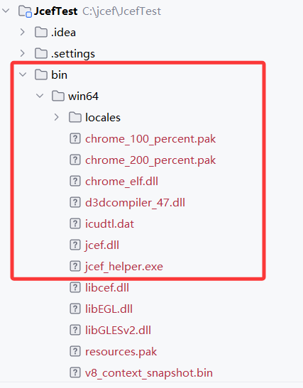
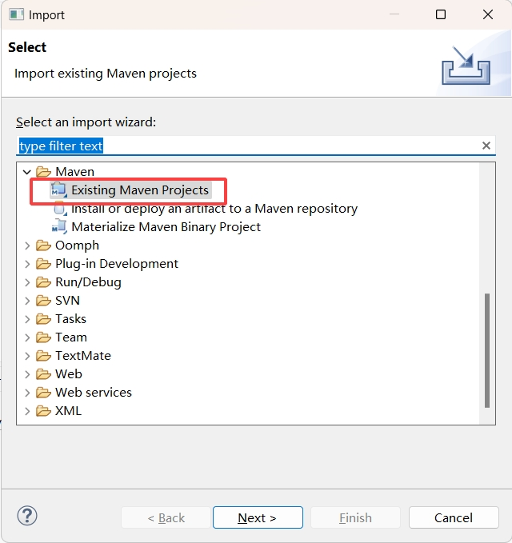
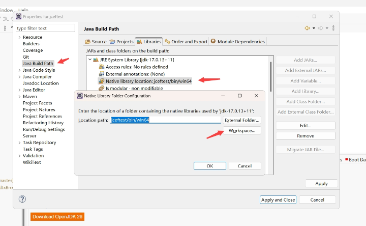
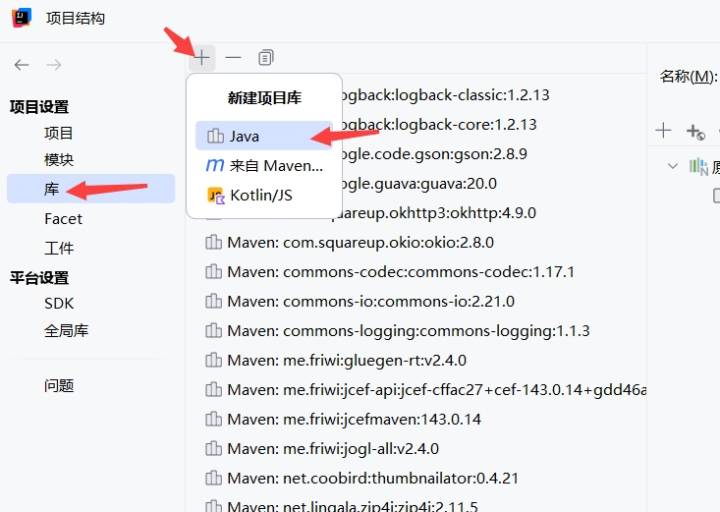
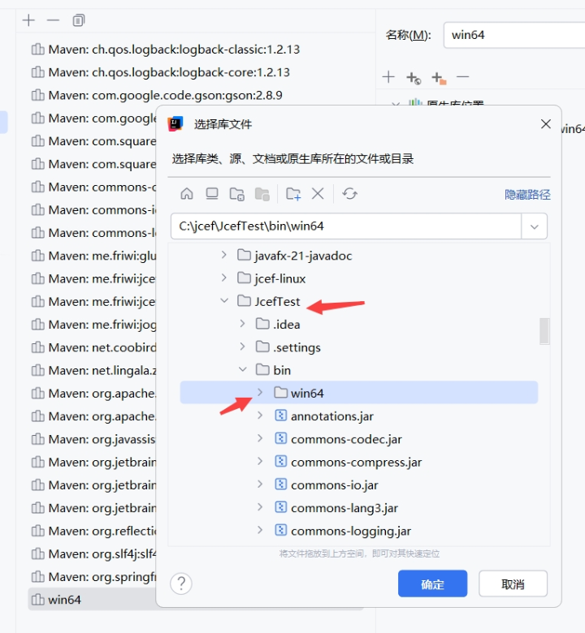
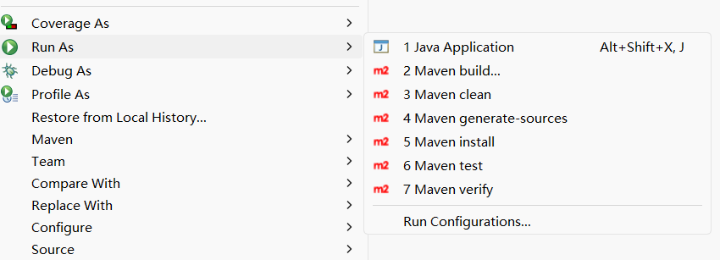
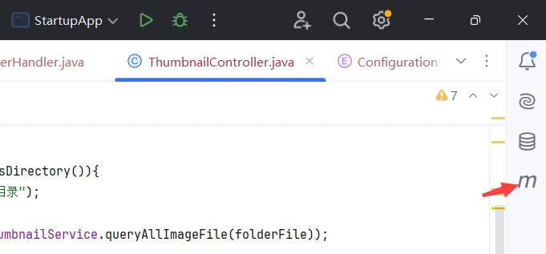
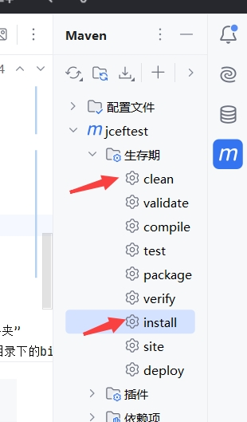
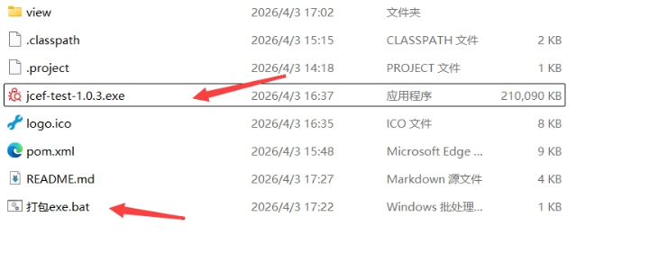
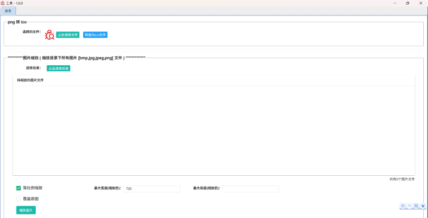

## JcefTest
> 本工程包含 JAVA与JS交互，鼠标右键菜单，以Tab形式展示浏览器、png转ico、图片缩放。在jdk14以上版本，可以使用 打包exe.bat 生成exe安装包  
> 个人修正的JCEF的API文档(中英文双语):  https://pan.baidu.com/s/18eioiDbIPM5aDdyn0TatVA  提取码: aptd  
> 
### 软件包说明  
com.xuanyimao.jceftest：包含JAVA与JS交互，鼠标右键菜单，以Tab形式展示浏览器的demo  
com.xuanyimao.app：这是一个demo，用于测试将项目打包为exe(包含 png转ico 和 图片缩放 两个功能)  
net.coobird.thumbnailator.util：图片缩放用到的thumbnailator库有bug，做了修改，与jcef无关  

### 环境(库)说明  
jdk版本为1.8以上。不过为了能使用jdk自带的jpackage打包为各平台安装包（exe，deb等）的功能，建议使用jdk14以上的版本  
maven建议用最新版本(3.8.5以上)  
使用了jcefmaven库( https://github.com/jcefmaven/jcefmaven )，这里面包含了所需的jar，但是仅仅是使用了它的jar包。根据官方文档的介绍，进行配置后，首次启动会自动下载所需的二进制库。我试了下启动报错，就用了另外的方式。  
使用了jcefbuild库( https://github.com/jcefmaven/jcefbuild/releases )，这里有官方构建好的二进制文件。  

## 更新内容
1、工程修改为maven工程  
2、增加windows下的打包为exe的批处理文件(需使用jdk14以上版本)  

## 工程导入
> 因为git无法上传大文件，所以jcef的二进制文件打成了压缩包，位于bin\win64下，先到此目录解压二进制文件  
> 解压后，jcef.dll的路径应当为 bin\win64\jcef.dll  
>   
### eclipse
注意：如果你要使用高版本的jdk，建议使用最新版本的eclipse  
1、以maven工程方式导入本项目  
  
2、项目右键，Properties(属性)>Java Build Path，展开JDK，双击Native library location，选择当前项目目录下的 bin\win64
  
3、随便选择一个测试类运行  

### idea  
1、导入工程
2、点击 项目结构 > 库 > 新建项目库 > Java 。选择项目下的 bin\win64，点击确定  
  
  
3、随便选择一个测试类运行  

## 打包jar 和 exe
1、运行maven的clean和install(牛逼点就敲mvn命令)，eclipse在右键菜单，idea通常在右上角，依次点一下就行。如果报错，大概率是maven本地仓库的jar包没下载好，可以去maven仓库确认一下  
### eclipse  
在项目上右键  
  

### idea  
  

2、jar包将生成在bin目录中，双击运行项目根目录的 打包exe.bat 文件，将会在项目根目录生成一个exe文件，双击此exe运行安装程序  
注意：如果你的高版本jdk没配置在环境变量中，请修改  打包exe.bat 中的 jpackage 为你高版本jdk中的绝对路径。  
比如我环境变量配置的是jdk1.8，我开发使用的是jdk17，我的jdk17安装在C:\git\jdk-17.0.13+11  
那么我打包的指令是：  
C:\git\jdk-17.0.13+11\bin\jpackage -i bin -n jcef-test --install-dir "jcef-test" --icon logo.ico --java-options "-Djava.library.path=.\app\win64" --app-version 1.0.3 --win-shortcut --win-menu --win-dir-chooser --main-jar jcef-test.jar  

每次打包时，请修改版本号(--app-version)，否则会无法安装。如果不想修改版本号，请先手动卸载已安装的版本再进行安装  
  

3、windows的图标请用ico图标，运行 com.xuanyimao.app.StartupApp，项目提供了将图片转换为ico图标的程序  
  